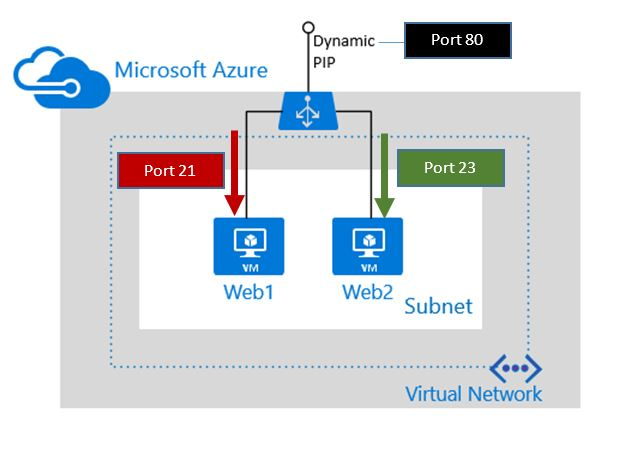

# Getting Started with Azure Resource Manager for load balancers in Python

This sample shows how to manage a load balancer using the Azure Resource Manager APIs for Python.

You can use a load balancer to provide high availability for your workloads in Azure. An Azure load balancer is a Layer-4 (TCP, UDP) type load balancer that distributes incoming traffic among healthy service instances in cloud services or virtual machines defined in a load balancer set.

To deploy an internet-facing load balancer, you'll need to create and configure the following objects.

* Front end IP configuration - contains public IP addresses for incoming network traffic. 

* Back end address pool - contains network interfaces (NICs) for the virtual machines to receive network traffic from the load balancer. 

* Load balancing rules - contains rules mapping a public port on the load balancer to port in the back end address pool.

* Inbound NAT rules - contains rules mapping a public port on the load balancer to a port for a specific virtual machine in the back end address pool.

* Probes - contains health probes used to check availability of virtual machines instances in the back end address pool.

You can get more information about load balancer components with Azure resource manager at [Azure Resource Manager support for Load Balancer](https://azure.microsoft.com/documentation/articles/load-balancer-arm/).

## Tasks done in this sample

1. Create a ResourceGroup
2. Create a Vnet
3. Create a subnet
4. Create a publicIP
5. Build the LoadBalancer Payload
  1. Build a FrontEndIpPool
  2. Build a BackendAddressPool
  3. Build a HealthProbe
  4. Build a LoadBalancerRule
  5. Build InboundNATRule1
  6. Build InboundNATRule2
6. Create the Load Balancer with the above Payload
7. Create NIC1
8. Create NIC2
9. Find an Ubutnu VM Image
10. Create an AvailabilitySet
11. Create the first VM: Web1
12. Create the second VM: Web2

## Run this sample
1. If you don't already have it, [install Python](https://www.python.org/downloads/).

2. We recommend using a [virtual environment](https://docs.python.org/3/tutorial/venv.html) to run this example, but it's not mandatory. You can initialize a virtual environment this way:

    pip install virtualenv
    virtualenv mytestenv
    cd mytestenv
    source bin/activate

3. Clone this repository.
    
    git clone https://github.com/Azure-Samples/virtual-machines-python-load-balancers.git    

4. Install the dependencies using pip.

    cd virtual-machines-python-load-balancers
    pip install -r requirements.txt    

5. Create an Azure service principal, using 
[Azure CLI](http://azure.microsoft.com/documentation/articles/resource-group-authenticate-service-principal-cli/),
[PowerShell](http://azure.microsoft.com/documentation/articles/resource-group-authenticate-service-principal/)
or [Azure Portal](http://azure.microsoft.com/documentation/articles/resource-group-create-service-principal-portal/).

6. Export these environment variables into your current shell. 
    
    export AZURE_TENANT_ID={your tenant id}
    export AZURE_CLIENT_ID={your client id}
    export AZURE_CLIENT_SECRET={your client secret}
    export AZURE_SUBSCRIPTION_ID={your subscription id}
    
7. Run the sample.
    
    python example.py
    
## More information

- [Azure SDK for Python](http://github.com/Azure/azure-sdk-for-python) 
